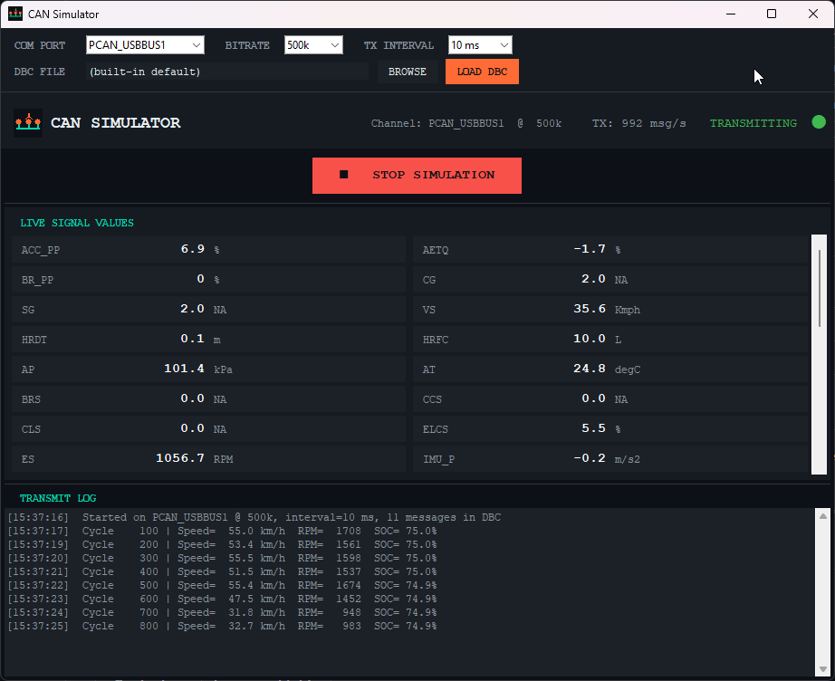
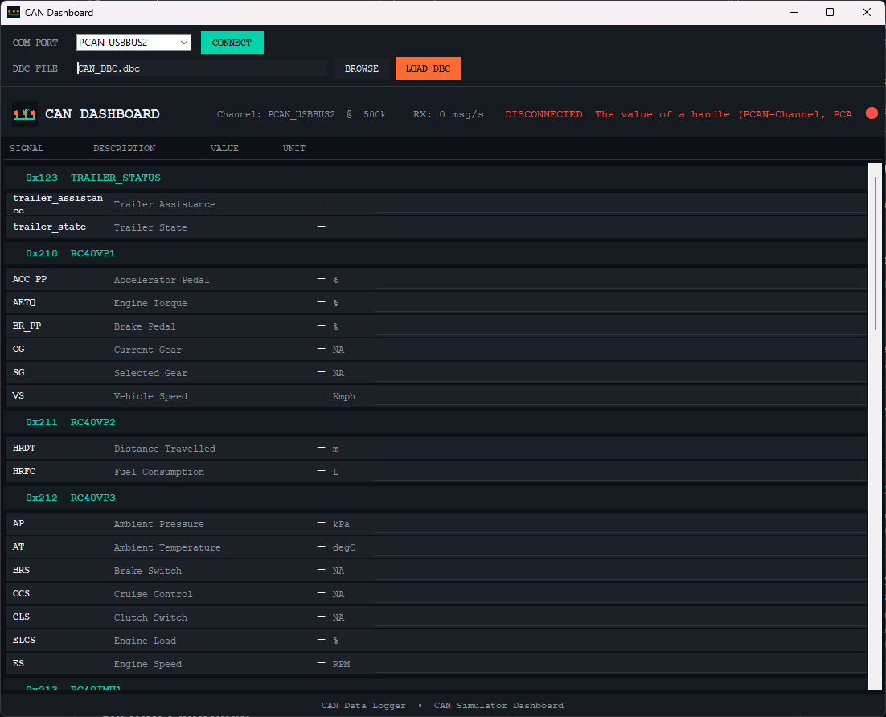
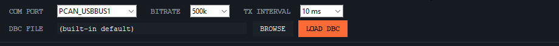
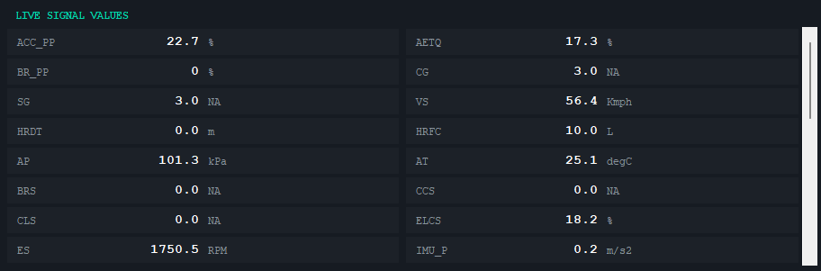
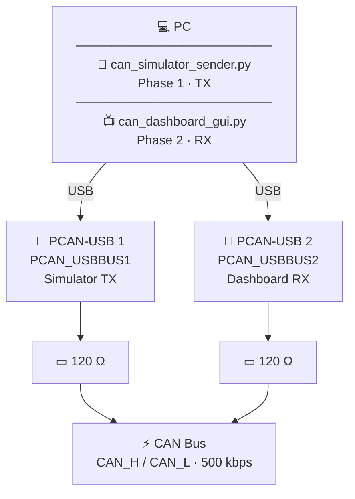

# CAN Simulator & Dashboard

A two-phase CAN bus development tool built with Python and Tkinter.

| Phase | Script | Role |
|:---:|---|---|
| **1** | `can_simulator_sender.py` | Read a DBC file, generate physics-based fake signals, transmit CAN frames |
| **2** | `can_dashboard_gui.py` | Connect to a live CAN bus, decode frames via DBC, display all signals in real time |

Both tools share the same dark UI theme, COM port selector, and DBC file loader — run them simultaneously on the same PC with two PCAN-USB adapters to test without real vehicle hardware.

---

## Screenshots

| Phase 1 — CAN Simulator | Phase 2 — CAN Dashboard |
|---|---|
|  |  |

| Config bar | Live signal table |
|---|---|
|  |  |

---

## System Overview

### Two-Phase Architecture



### Wiring Reference

| PCAN-USB DB9 Pin | Signal | Wire colour (typical) |
|:---:|---|---|
| 2 | CAN_L | Blue |
| 7 | CAN_H | White |
| 3 / 6 | GND (optional shield) | Black |

> **Termination:** fit a 120 Ω resistor at each physical end of the CAN bus.  
> PCAN-USB adapters have a built-in software-selectable terminator — enable it when the adapter is at a bus endpoint.

---

## Features

### Phase 1 — CAN Simulator

- **DBC-driven simulation** — loads any `.dbc` file and transmits all its messages at configurable rate
- **Physics-based vehicle model** — speed, RPM, SOC, battery, torque, temperatures, IMU, wheel speeds all evolve realistically with Gaussian noise
- **COM port selector** — choose PCAN channel, bitrate (125k–1M), and TX interval (1–100 ms) from the GUI
- **Live signal panel** — scrollable table showing every transmitted signal updated in real time
- **Transmit log** — timestamped log of connection events and periodic cycle snapshots
- **Headless CLI mode** — `--no-gui` flag for scripted / automated testing

### Phase 2 — CAN Dashboard

- **Live signal display** — all CAN signals grouped by message ID, updating at 20 Hz
- **COM port selector** — choose any PCAN USB channel and reconnect on the fly
- **DBC file loader** — browse and load any `.dbc` file; signal rows rebuild automatically
- **Built-in DBC** — ships with a full RC40 vehicle bus definition (speed, torque, battery, IMU, wheel speed, etc.)
- **Virtual / derived signals** — SOC alias, energy usage (kW), vehicle stationary state, computed automatically
- **Headless library** — `can_monitor.py` can be imported in any Python project without a GUI

---

## Hardware Requirements

- [PEAK PCAN-USB](https://www.peak-system.com/PCAN-USB.199.0.html) or PCAN-USB Pro adapter (one per phase when running both simultaneously)
- CAN bus with 120 Ω termination resistors at each physical end

---

## Installation

### 1. Clone the repository

```bash
git clone https://github.com/amirgol64/CAN_simulator.git
cd CAN_simulator
```

### 2. Create a virtual environment (recommended)

```bash
python -m venv .venv
# Windows
.venv\Scripts\activate
# macOS / Linux
source .venv/bin/activate
```

### 3. Install dependencies

```bash
pip install python-can cantools
```

### 4. Install PCAN drivers (Windows)

Download and install the [PEAK PCAN Basic driver](https://www.peak-system.com/Software-APIs.305.0.html?&L=1) from the PEAK website.

---

## Usage

### Phase 1 — CAN Simulator

```bash
python can_simulator_sender.py
```

Launches the simulator GUI. Select the PCAN channel, bitrate, TX interval, and optionally load a custom DBC, then press **▶ START SIMULATION**.

| Control | Description |
|---|---|
| **COM PORT** dropdown | PCAN channel to transmit on (`PCAN_USBBUS1`–`PCAN_USBBUS8`) |
| **BITRATE** dropdown | CAN bitrate: 125k / 250k / 500k / 1M |
| **TX INTERVAL** dropdown | Frame period: 1 ms – 100 ms (default 10 ms = 100 Hz) |
| **DBC FILE** + **BROWSE** | Load a custom DBC; signals not in the vehicle model default to 0 |
| **LOAD DBC** | Apply the selected DBC and refresh the live signal panel (stops simulation first) |
| **▶ START** / **■ STOP** | Toggle simulation on/off |
| Live signal panel | Scrollable table of all transmitted signals, updated at 10 Hz |
| Transmit log | Timestamped log of connection events and per-100-cycle snapshots |

#### Headless / CLI mode

```bash
python can_simulator_sender.py --no-gui --channel PCAN_USBBUS1 --bitrate 500000 --interval 0.01
```

---

### Phase 2 — CAN Dashboard

```bash
python can_dashboard_gui.py
```

With explicit startup parameters:

```bash
python can_dashboard_gui.py --channel PCAN_USBBUS2 --bitrate 500000
```

| Control | Description |
|---|---|
| **COM PORT** dropdown | PCAN channel to listen on (`PCAN_USBBUS1`–`PCAN_USBBUS8`) |
| **CONNECT** button | Reconnect the monitor on the selected channel |
| **DBC FILE** + **BROWSE** | Pick a `.dbc` file to use for decoding |
| **LOAD DBC** | Reload the database; all signal rows rebuild from the new DBC |
| Signal table | All signals grouped by message ID, value + unit updated at 20 Hz |

#### Running both phases together (loopback test)

1. Wire two PCAN-USB adapters together (CAN\_H to CAN\_H, CAN\_L to CAN\_L, 120 Ω at each end)
2. Open **two terminals**:
   ```bash
   # Terminal 1 — Simulator (TX on USBBUS1)
   python can_simulator_sender.py

   # Terminal 2 — Dashboard (RX on USBBUS2)
   python can_dashboard_gui.py
   ```
3. Start the simulator — signals appear live in the dashboard

---

### Library usage (headless)

```python
from can_monitor import CANMonitor

mon = CANMonitor(channel="PCAN_USBBUS2", bitrate=500000)
mon.subscribe("VS",     lambda name, val: print(f"Speed: {val:.1f} km/h"))
mon.subscribe("BT_SOC", lambda name, val: print(f"SOC:   {val:.1f} %"))
mon.subscribe("*",      lambda name, val: ...)   # every signal
mon.start()

import time
time.sleep(10)
print(mon.get_all())   # snapshot dict of all current values
mon.stop()
```

Custom DBC:

```python
mon = CANMonitor(channel="PCAN_USBBUS2", bitrate=500000, dbc_path="my_vehicle.dbc")
```

---

## DBC File Support

The built-in DBC covers the **RC40 vehicle bus**:

| Message | ID | Signals |
|---|---|---|
| RC40VP1 | 0x210 | Speed, throttle, brake, torque, gear |
| RC40VP2 | 0x211 | Distance, fuel consumption |
| RC40VP3 | 0x212 | Engine speed/load, ambient temp/pressure |
| RC40IMU1/2 | 0x213/214 | Pitch, roll, yaw, angular rates |
| RC40LLC1–5 | 0x215–219 | Motor torque, battery SOC/V/A, temperatures |
| RC40WSS1 | 0x220 | Wheel speed sensors |
| TRAILER\_STATUS | 0x123 | Trailer connection state |
| CHARGER\_STATUS | 0x234 | Charger connection state |

**Using a custom DBC:** click **BROWSE**, select the file, then **LOAD DBC**.  
Signal descriptions fall back to the DBC `SG_` comment field, then the raw signal name.  
Signals in the DBC that are not in the built-in vehicle model will transmit as `0.0`.

---

## Project Structure

```
CAN_simulator/
├── can_simulator_sender.py  # Phase 1 — simulator GUI + headless CLI
├── can_dashboard_gui.py     # Phase 2 — live dashboard GUI
├── can_monitor.py           # Shared headless CAN monitor library (no GUI deps)
├── simpleTest.py            # Minimal library usage example
├── docs/
│   └── screenshots/         # Place UI screenshots here (see README image refs)
├── LICENSE
└── README.md
```

### Python Files

#### `can_simulator_sender.py` — Phase 1: CAN Simulator

Generates a physics-based fake vehicle and transmits it onto the CAN bus.

| Component | Description |
|---|---|
| `VehicleSimState` | Physics model: speed, RPM, SOC, temperatures, pedals, gear |
| `VehicleSimState.step(dt)` | Advance simulation by `dt` seconds with Gaussian noise |
| `VehicleSimState.signal_values()` | Returns dict of all RC40 signal values for the current state |
| `clamp_to_signal(sig, val)` | Clamps a value to the signal's DBC-defined min/max range |
| `SimulatorApp` | Tkinter GUI — config bar, ▶/■ button, scrollable live signal panel, TX log |
| `_draw_can_icon(size, tx)` | Programmatically draws the CAN bus topology icon (TX variant) |
| `main()` | Headless CLI entry point — use `--no-gui` to skip the GUI |

Signals simulated per cycle: vehicle speed, RPM, gear, pedals, motor torque, battery SOC/V/A, temperatures (motor, MCU, cell), IMU pitch/roll/yaw, wheel speed frequencies, articulation angle.

---

#### `can_dashboard_gui.py` — Phase 2: CAN Dashboard

Receives and decodes live CAN frames, renders all signals in a scrollable table.

| Component | Description |
|---|---|
| `CANDashboard` | Main `tk.Tk` window — wires `CANMonitor`, builds UI, runs 20 Hz update loop |
| `_build_config_bar()` | Top bar: COM port + CONNECT, DBC path + BROWSE / LOAD DBC |
| `_rebuild_signals()` | Clears and recreates all signal rows from the active DBC |
| `_on_connect_clicked()` | Stops monitor, creates new one on selected channel, restarts |
| `_on_dbc_load()` | Loads selected DBC, restarts monitor, rebuilds signal rows |
| `_schedule_ui_update()` | 20 Hz loop: flushes pending signal updates to the UI |
| `SignalRow` | Row widget — signal name, description, live value, unit |
| `_draw_can_icon(size, tx)` | Programmatically draws the CAN bus topology icon (RX variant) |

**Data flow:**

```
CAN bus frames
    ↓  (python-can PCAN driver)
CANMonitor._rx_loop()              ← daemon thread
    ↓  cantools DBC decode
CANMonitor._dispatch()             ← fires callbacks, stores values
    ↓  thread-safe lock
CANDashboard._on_signal()          ← queues update in _pending dict
    ↓  50 ms timer (20 Hz)
CANDashboard._schedule_ui_update() ← batch flush
    ↓
SignalRow.update_value()           ← updates label text in UI
```

---

#### `can_monitor.py` — Shared CAN Monitor Library

The core decoding engine. No GUI dependencies — import directly in any Python project.

| Component | Description |
|---|---|
| `CANMonitor` | Connects to PCAN bus, decodes frames via DBC, fires signal callbacks |
| `CANMonitor.subscribe(signal, cb)` | Register callback for a named signal or `"*"` for all signals |
| `CANMonitor.get(signal)` | Poll the latest decoded value |
| `CANMonitor.get_all()` | Snapshot dict of all current signal values |
| `CANMonitor.inject(signal, value)` | Push a simulated or virtual value into the pipeline |
| `CANMonitor.db` | Access to the underlying `cantools` database object |
| `SIGNAL_DESCRIPTIONS` | Dict: raw signal name → human-readable label |

**Constructor:**

```python
CANMonitor(
    channel="PCAN_USBBUS2",   # PCAN channel name
    bitrate=500_000,           # CAN bus bitrate in bps
    retry_interval=3.0,        # seconds between reconnect attempts
    dbc_path=None,             # path to .dbc file  (None = use built-in)
)
```

**Virtual / derived signals** (auto-computed after every decoded frame):

| Signal | Source | Description |
|---|---|---|
| `soc` | `BT_SOC` | Battery SOC alias |
| `energy_usage_kw` | `BT_C × BT_V ÷ 1000` | Instantaneous power in kW |
| `energy_usage_stat` | sign of `BT_C` | `"discharge"` / `"generate"` / `"free"` |
| `vs` | `VS < 0.5` | Vehicle stationary: `"0"` / `"1"` |
| `ss` | `VS < 0.5` | Standstill: `"on"` / `"off"` |
| `truck_eng_stat` | `AETQ > 0` | Engine status: `"on"` / `"off"` |

---

#### `simpleTest.py` — Minimal Example

```python
from can_monitor import CANMonitor
mon = CANMonitor(channel="PCAN_USBBUS2")
mon.start()
# prints SOC value + unit every second
```

---

## Requirements

| Package | Purpose |
|---|---|
| `python-can` | CAN bus interface (PCAN driver backend) |
| `cantools` | DBC parsing and message decoding |
| `tkinter` | GUI (included with Python on Windows) |

Python **3.9+** required.

---

## License

MIT License — see [LICENSE](LICENSE) for details.
