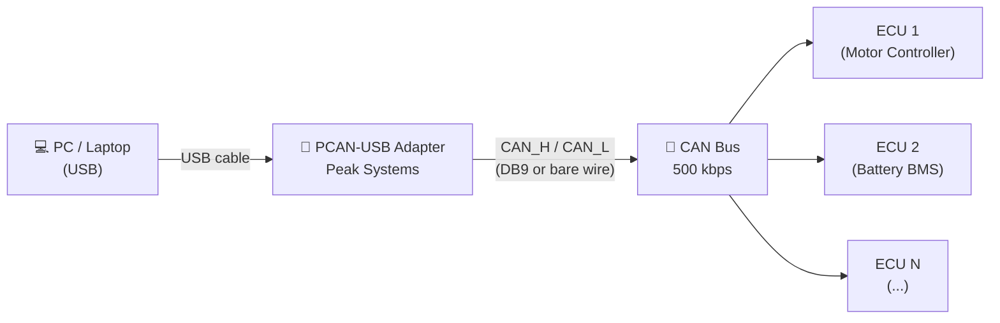

# CAN Dashboard

A real-time CAN bus monitor and dashboard built with Python and Tkinter.  
Connects to a PCAN-USB adapter, decodes frames via a DBC file, and displays all signals live with values and units.


---

## Features

- **Live signal display** — all CAN signals grouped by message ID, updating at 20 Hz
- **COM port selector** — choose any PCAN USB channel (PCAN\_USBBUS1–8) from a dropdown and reconnect on the fly
- **DBC file loader** — browse and load any `.dbc` file; signal rows rebuild automatically from the new database
- **Built-in DBC** — ships with a full RC40 vehicle bus definition (speed, torque, battery, IMU, wheel speed, etc.)
- **Virtual / derived signals** — SOC alias, energy usage (kW), vehicle stationary, engine status, computed from raw CAN values
- **CAN simulator** — `can_simulator_sender.py` generates a physics-aware fake vehicle bus for offline testing
- **Headless library** — `can_monitor.py` can be imported in any Python project without a GUI

---

## Hardware Requirements

- [PEAK PCAN-USB](https://www.peak-system.com/PCAN-USB.199.0.html) or PCAN-USB Pro adapter  
- CAN bus with 120 Ω termination resistors at each end of the bus

### Connection Diagram

```
┌─────────────┐   USB   ┌──────────────────┐   CAN   ┌─────────────────────────┐
│             │─────────│                  │─────────│                         │
│  PC / Laptop│         │  PCAN-USB Adapter│  CAN_H  │  Vehicle CAN Bus        │
│             │         │  (PEAK Systems)  │─────────│  (ECUs, controllers...) │
└─────────────┘         │                  │  CAN_L  │                         │
                        └──────────────────┘─────────└─────────────────────────┘
```



### Wiring Reference

| PCAN-USB DB9 Pin | Signal | Wire colour (typical) |
|:---:|---|---|
| 2 | CAN_L | Blue |
| 7 | CAN_H | White |
| 3 / 6 | GND (optional shield) | Black |

> **Tip:** Always ensure 120 Ω termination resistors are fitted at both physical ends of the CAN bus.  
> The PCAN-USB adapter has a built-in software-selectable terminator.

### Dashboard UI

| Config bar | Live signals |
|---|---|
|  |  |

---

## Installation

### 1. Clone the repository

```bash
git clone https://github.com/<your-username>/CAN_simulator.git
cd CAN_simulator
```

### 2. Create a virtual environment (recommended)

```bash
python -m venv .venv
# Windows
.venv\Scripts\activate
# macOS / Linux
source .venv/bin/activate
```

### 3. Install dependencies

```bash
pip install python-can cantools
```

### 4. Install PCAN drivers (Windows)

Download and install the [PEAK PCAN Basic driver](https://www.peak-system.com/Software-APIs.305.0.html?&L=1) from the PEAK website.

---

## Usage

### Dashboard GUI

```bash
python can_dashboard_gui.py
```

With explicit channel and bitrate:

```bash
python can_dashboard_gui.py --channel PCAN_USBBUS1 --bitrate 500000
```

#### Runtime controls

| Control | How to use |
|---|---|
| **COM PORT** dropdown | Select the PCAN channel (`PCAN_USBBUS1`–`PCAN_USBBUS8`) or type a custom name |
| **CONNECT** button | Reconnect the monitor on the selected channel |
| **DBC FILE** field | Type a path or use the BROWSE button to pick a `.dbc` file |
| **LOAD DBC** button | Reload the database; signal rows rebuild automatically |

### CAN Simulator (no hardware needed)

Generates a physics-based fake vehicle on the bus for testing:

```bash
python can_simulator_sender.py
```

Run the sender in one terminal and the dashboard in another to see live simulated data.

### Library usage (headless)

```python
from can_monitor import CANMonitor

mon = CANMonitor(channel="PCAN_USBBUS1", bitrate=500000)
mon.subscribe("VS", lambda name, val: print(f"Speed: {val:.1f} km/h"))
mon.subscribe("BT_SOC", lambda name, val: print(f"SOC: {val:.1f} %"))
mon.subscribe("*", lambda name, val: ...)   # every signal
mon.start()

import time
time.sleep(10)
print(mon.get_all())   # snapshot dict of all current values
mon.stop()
```

Load a custom DBC file:

```python
mon = CANMonitor(channel="PCAN_USBBUS1", bitrate=500000, dbc_path="my_vehicle.dbc")
```

---

## DBC File Support

The built-in DBC covers the **RC40 vehicle bus**:

| Message | ID | Signals |
|---|---|---|
| RC40VP1 | 0x210 | Speed, throttle, brake, torque, gear |
| RC40VP2 | 0x211 | Distance, fuel consumption |
| RC40VP3 | 0x212 | Engine speed/load, ambient temp/pressure |
| RC40IMU1/2 | 0x213/214 | Pitch, roll, yaw, angular rates |
| RC40LLC1–5 | 0x215–219 | Motor torque, battery SOC/V/A, temperatures |
| RC40WSS1 | 0x220 | Wheel speed sensors |
| TRAILER\_STATUS | 0x123 | Trailer connection state |
| CHARGER\_STATUS | 0x234 | Charger connection state |

To use your own DBC: click **BROWSE** in the dashboard, select the file, then click **LOAD DBC**.  
Signal descriptions fall back to the DBC `SG_` comment field, then the raw signal name.

---

## Project Structure

```
CAN_simulator/
├── can_dashboard_gui.py     # Tkinter GUI — dashboard + config bar
├── can_monitor.py           # Headless CAN monitor library (no GUI deps)
├── can_simulator_sender.py  # Physics-based CAN frame generator for testing
├── simpleTest.py            # Minimal usage example
├── docs/
│   └── screenshots/         # Place your UI screenshots here
└── README.md
```

---

## Requirements

| Package | Purpose |
|---|---|
| `python-can` | CAN bus interface (PCAN driver backend) |
| `cantools` | DBC parsing and message decoding |
| `tkinter` | GUI (included with Python on Windows) |

Python **3.9+** required.

---

## License

MIT License — see [LICENSE](LICENSE) for details.
